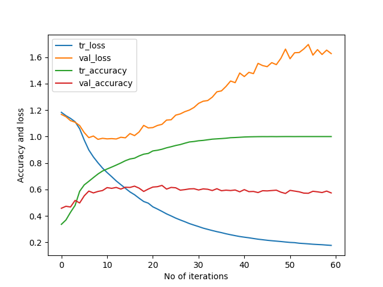

# DrivingDirection-8-63
163/163 [==============================] - 0s 3ms/step - loss: 0.1774 - accuracy: 1.0000 - val_loss: 1.6273 - val_accuracy: 0.5740  
[[218  62  57]    
 [ 66  83  25]    
 [ 77  21 114]]    
163/163 [==============================] - 0s 1ms/step - loss: 0.4154 - accuracy: 0.9178   
23/23 [==============================] - 0s 2ms/step - loss: 1.0924 - accuracy: 0.6307     
Train: 0.918, Test: 0.631    
[[237  50  50]               
 [ 59  88  27]                
 [ 68  13 131]]                
 
 
 
 
 
